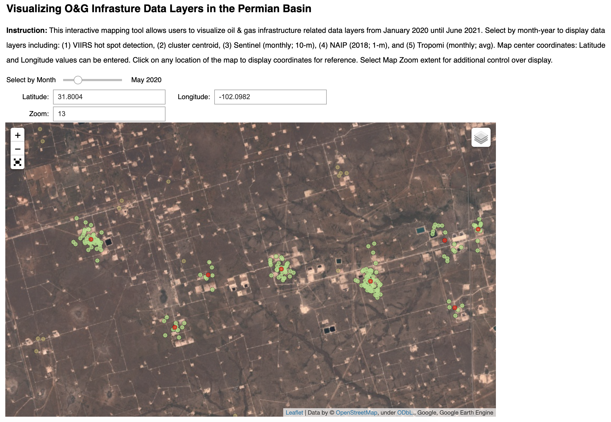

# Examining Methods for Oil & Gas Infrastructure Detection in the Permian Basin

## Table of Contents  
- [Project Details](#project-details)  
- [Data Sources](#data-sources)  
- [Walk-Through](#walk-through)  
    1. [Interactive Mapping](#(1)-interactive-mapping)  
___

## Project Details

This project serves to leverage tools within an iPython notebook environment to aid in the development of an interactive user interface for exploring campgrounds within California. The application will allow users to identify the availability of a particular campground, based on a series of search criterias regarding location, campsite amenities, and various other conditions. This immersive experience is made possible by an array of packages, mainly folium and ipywidget. 

## Data Sources

A combination of high resolution imagery, and satellite-based products that detect methane emissions and gas flares were collected from January 2020 to June 2021. 

* 2018 NAIP (1m) Imagery
* Monthly Sentinel (10m) 
* Monthly TROPOMI - Methane Readings 
* VIIRS NOAA Active Fire Detections 

## Walk-Through

## (1) Interactive mapping

